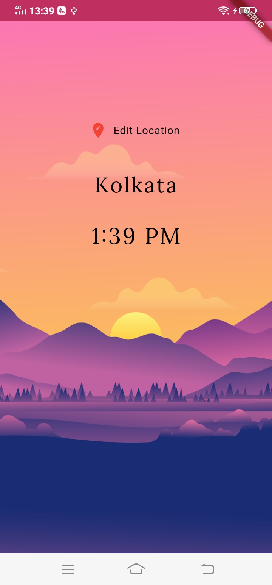
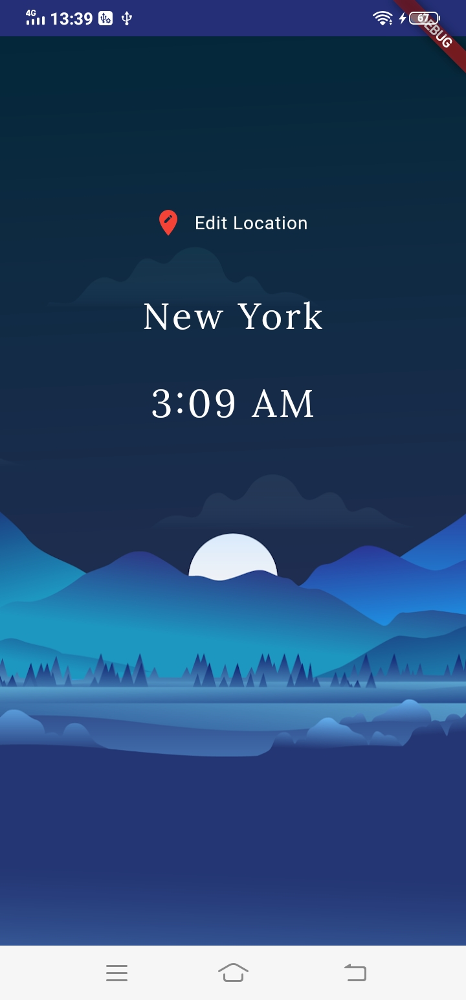
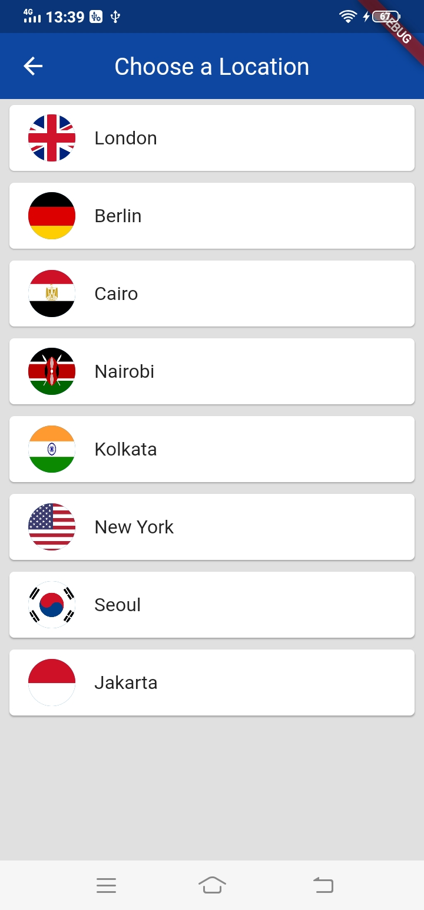

## Flutter-World-Time App 🕒

A simple Flutter time application displaying the time of some selected cities in the world. 

## Screenshots 📷

                              
                              
    

